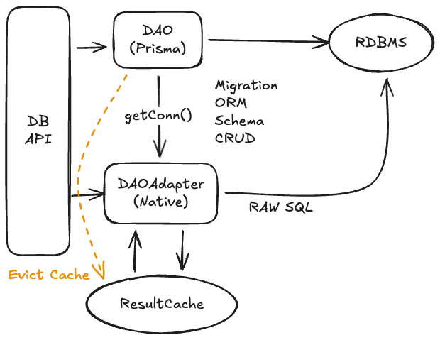

# Desafio Datacrazy

Parabéns! Se você chegou até aqui, queremos conhecê-lo(a).

Temos alguns desafios que selecionamos para testar os seus conhecimentos. Você pode escolher quantos desafios estiver pronto(a) para executar.

Vamos lá?

## Desafio n.º 1 :: Front-end de mensageria

### Objetivo

Crie uma aplicação web utilizando React que permita:

1.  Solicitar e obter permissão de áudio do navegador;
2.  Capturar o áudio do usuário em tempo real;
3.  Enviar o áudio para a API de transcrição da OpenAI (Whisper) e exibir o texto transcrito;
4.  Enviar a transcrição para a API de completions da OpenAI (ChatGPT) e exibir a resposta gerada em tela.

### Requisitos Técnicos

1.  Utilizar React (com ou sem um framework como Next.js);
2.  Organizar o código em componentes reutilizáveis;
3.  Utilizar boas práticas de estrutura de pastas e separação de responsabilidades;
4.  Interagir com as APIs da OpenAI (transcrição e completions).

### O que será avaliado

1.  Clareza e organização do código;
2.  Capacidade de encarar e resolver desafios técnicos, como lidar com permissões do navegador, conversão de áudio e chamadas assíncronas;
3.  Boas práticas com React (componentização, estado, hooks, etc.);
4.  Se você usar IA para gerar seu código e seu projeto, esteja pronto(a) para explicar tudo ao vivo. Queremos que você use IA para escalar sua produtividade, e não para que ela trabalhe por você.

Boa sorte!

## Desafio n.º 2 :: Backend com Prisma pode ser reforçado?

### Objetivo

1.  Crie uma classe que exponha métodos DAO que implementem (create/delete/update/getById/findByName) de uma entidade `Pessoa` (abstraia as propriedades dessa classe, como nome, idade, CPF, endereço, e-mail, telefone, etc.).
2.  Nesta mesma interface, construa mais dois métodos, `findByEmail()` e `findByTelefone()`, que, em vez de usar a API nativa de consulta do Prisma, utilizem um `SELECT ... FROM ... WHERE` nativo do RDBMS escolhido.
3.  Nestes mesmos métodos, guarde o resultado da consulta em algum cache (Redis? Talvez não. Surpreenda-nos se encontrar um cache melhor, se existir). Assim, se o método for chamado novamente para um mesmo endereço de e-mail, ele buscará o resultado que está em cache.
4.  Dica: você pode fazer um hash SHA256 do SQL bruto para usar como `key` desse cache.
5.  Preveja quanto tempo seria seguro manter os dados em cache.
6.  Como forçar a exclusão do cache se o registro for atualizado no Prisma?

### Requisitos Técnicos

1.  Usar o Prisma ORM;
2.  Conectar a um banco de dados usando o Prisma como um `ConnectionFactory`, para não precisarmos de dois mecanismos para obter conexões de um banco de dados;
3.  Usar SQL nativo (simples);
4.  Usar uma camada de cache no código;
5.  Sofisticar o código com controle de cache, como Evict e TTL.

### O que será avaliado

1.  Clareza e organização do código;
2.  Capacidade de encarar e resolver desafios técnicos, como lidar com RDBMS e mecanismos de cache;
3.  Boas práticas de cache e de performance;
4.  Se você usar IA para gerar seu código e seu projeto, esteja pronto(a) para explicar tudo ao vivo. Queremos que você use IA para escalar sua produtividade, e não para que ela trabalhe por você.

Boa sorte.
